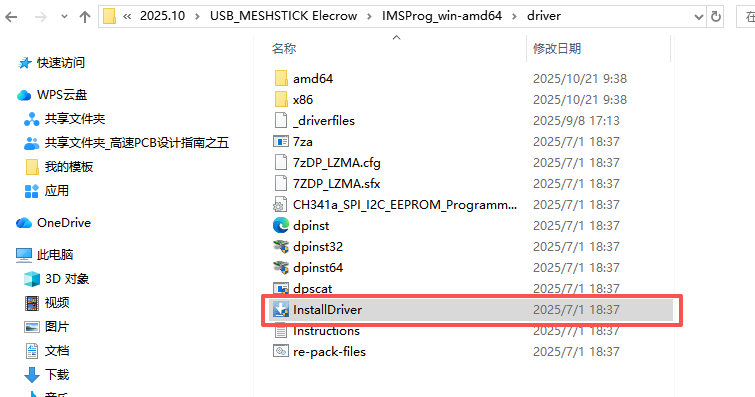
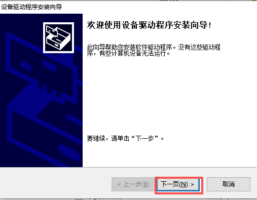
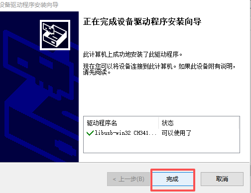
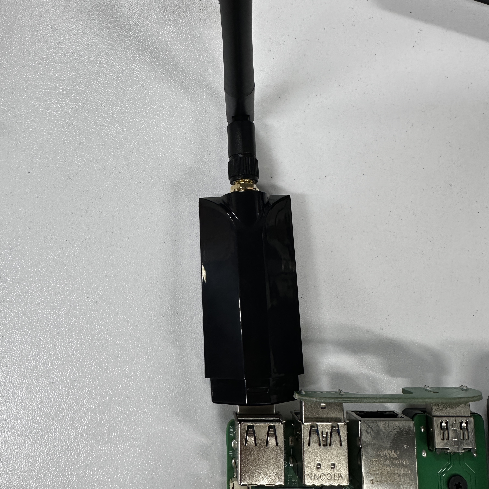
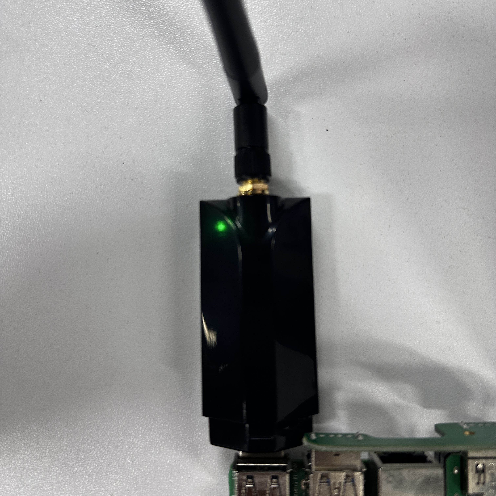
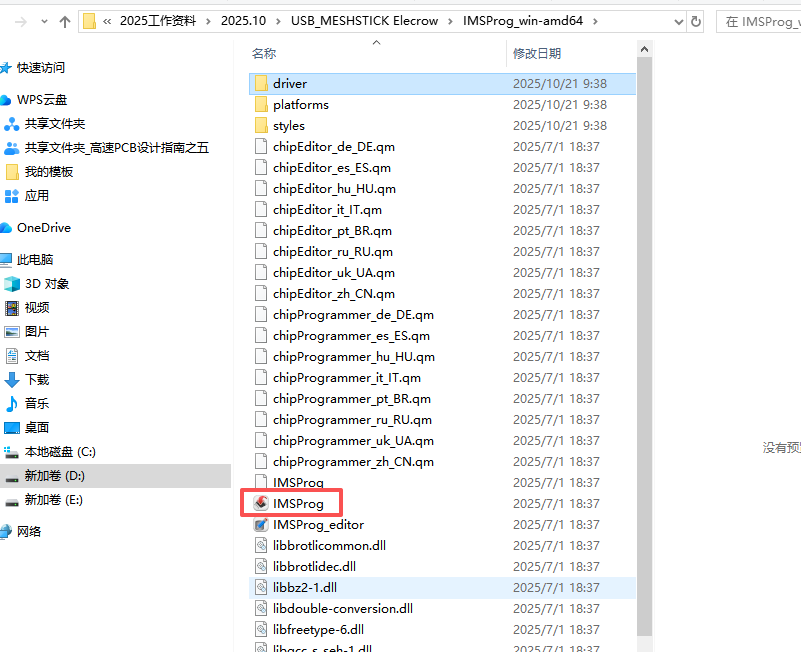
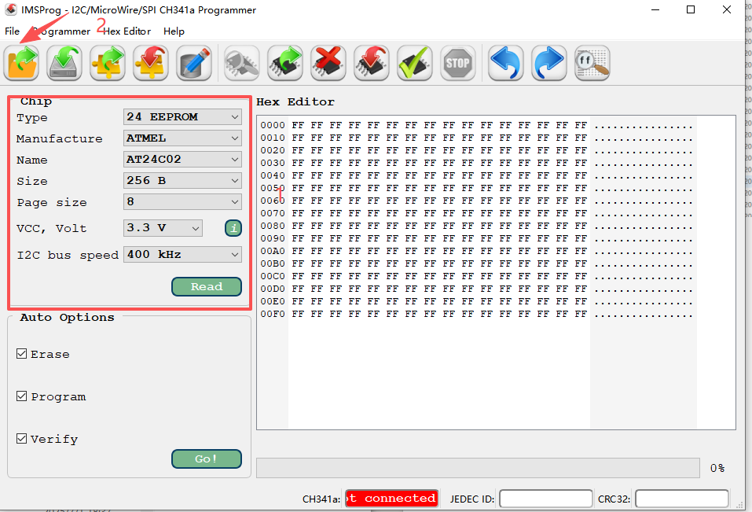
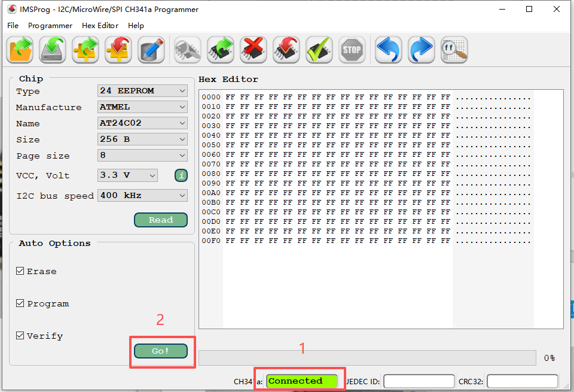
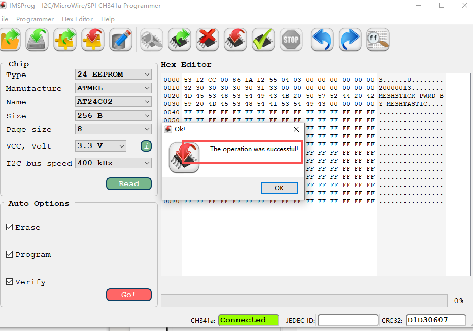

# USB MESHSTICK Elecrow Driver Installation and Firmware Flashing Guide

This guide explains how to install the USB MESHSTICK Elecrow V1.0 driver on Windows and use IMSProg to flash the test firmware to the onboard AT24C02 EEPROM.

## File Structure

```text
.
├── firmware/
│   └── 24C02C-20260713.bin
├── docs/
│   └── images/
├── IMSProg_win-amd64/
│   ├── driver/
│   │   └── InstallDriver.exe
│   └── IMSProg.exe
├── driver-installed.jpg
├── driver-not-installed.jpg
└── README.md
```

- Driver installer: `IMSProg_win-amd64/driver/InstallDriver.exe`
- Firmware file: `firmware/24C02C-20260713.bin`
- Flashing tool: `IMSProg_win-amd64/IMSProg.exe`

## Requirements

- Windows computer
- USB MESHSTICK Elecrow V1.0
- USB data cable

## Install the Driver

1. Open the `IMSProg_win-amd64/driver` folder.
2. Right-click `InstallDriver.exe` and select **Run as administrator**.

   

3. In the Device Driver Installation Wizard, click **Next**.

   

4. Wait for the driver installation to finish, then click **Finish**.

   

If Windows displays a User Account Control prompt, confirm it to continue the installation.

After connecting the device to a USB port, check its power status using the indicator light:

| Before driver installation | After driver installation |
| --- | --- |
|  |  |

## Flash the Firmware

1. Open the `IMSProg_win-amd64` folder and run `IMSProg.exe`.

   

2. Configure the chip settings on the left side of IMSProg as follows:

   | Setting | Value |
   | --- | --- |
   | Type | `24 EEPROM` |
   | Manufacturer | `ATMEL` |
   | Name | `AT24C02` |
   | Size | `256 B` |
   | Page size | `8` |
   | VCC, Volt | `3.3 V` |
   | I2C bus speed | `400 kHz` |

3. Click the **Open File** button on the toolbar and select `firmware/24C02C-20260713.bin`.

   

4. Connect the USB MESHSTICK to a USB port on the computer.
5. Confirm that the bottom of the IMSProg window displays a green `Connected` status.
6. Keep `Erase`, `Program`, and `Verify` selected, then click `Go!`.

   

7. Wait for flashing and verification to finish. The message `The operation was successful!` confirms that the firmware was flashed successfully.

   

Do not disconnect the device or close IMSProg while flashing is in progress.

## Troubleshooting

### IMSProg Does Not Display Connected

1. Confirm that the driver was installed successfully.
2. Disconnect and reconnect the USB MESHSTICK.
3. Try another USB port or USB data cable.
4. Close and reopen IMSProg.

### Firmware Flashing Fails

1. Confirm that `firmware/24C02C-20260713.bin` is selected.
2. Verify that the chip model, voltage, and I2C bus speed match the settings listed above.
3. Confirm that the status is `Connected`, then click `Go!` again.

## File Verification

After downloading or copying the files, use SHA-256 to verify their integrity:

```text
InstallDriver.exe
7CAF24057C5047F1EADDAA8E72E6B8B52DAEC24284BBB96B3DACFE9EF669FB0D

24C02C-20260713.bin
C14D0A7029E3D46F1A179C80E08C896195BF5D47245DBB68CFFFF5C5605964F0
```
